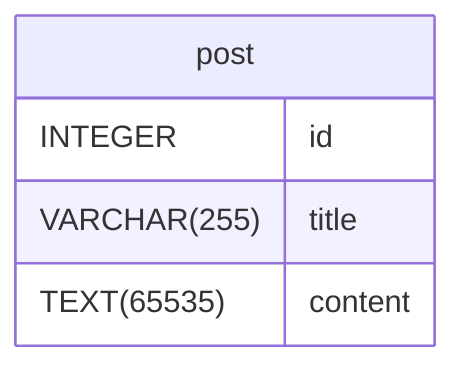

# 應用程式規劃範例

## 資料庫

### 工具

> 使用[drawDB](https://www.drawdb.app/)

### 風格

- 蛇形(Snake Case)

全小寫英文字詞，在多個字詞間使用下底線符號 underscore(\_)來分隔。
例如: first_name 或 last_name

- 英文單數詞(Singular)

### 資料庫

#### post

| Name        | Type         | Settings                                | References | Note |
| ----------- | ------------ | --------------------------------------- | ---------- | ---- |
| **id**      | INTEGER      | 🔑 PK, not null , unique, autoincrement |            |      |
| **title**   | VARCHAR(255) | not null                                |            |      |
| **content** | TEXT(65535)  | not null                                |            |      |

##### 關聯 Relationships

##### 資料庫圖表



### SQL

建立資料表:

```sql
CREATE OR REPLACE TABLE `post` (
	`id` INTEGER NOT NULL AUTO_INCREMENT UNIQUE,
	`title` VARCHAR(255),
	`content` TEXT(65535),
	PRIMARY KEY(`id`)
);
```

#### 讀取(所有):

```sql
SELECT * FROM post;
```

prisma:

```js
// data是多筆資料陣列
const data = await prisma.post.findMany()
```

#### 讀取(單筆 使用 id):

```sql
SELECT * FROM post WHERE id = 1;
```

prisma:

```js
// data是單筆物件
const data = await prisma.post.findUnique({
  where: {
    id: 1,
  },
})
```

#### 新增:

```sql
INSERT INTO post (title, content) VALUES ('Post2', 'pp1p2321321');
```

prisma:

```js
// newPost是單筆物件
const newPost = await prisma.post.create({
  data: {
    title: 'Post2',
    content: 'pp1p2321321',
  },
})
```

#### 修改(使用 id):

```sql
UPDATE post SET title = 'Post123', content = 'XXXXX' WHERE id = 1;
```

prisma:

```js
const updatePost = await prisma.post.update({
  where: {
    id: 1,
  },
  data: {
    title: 'Post123',
    content: 'XXXXX',
  },
})
```

#### 刪除(使用 id):

```sql
DELETE FROM post WHERE id = 1;
```

prisma:

```js
const deletePost = await prisma.post.delete({
  where: {
    id: 1,
  },
})
```

## API 路由

### C(建立)

```http
POST http://localhost:3005/api/posts HTTP/1.1
content-type: application/json

{
    "title": "post1",
    "content": "abc12345xxx"
}
```

### R(讀取)

#### 多筆(所有)

```http
GET /api/posts
```

#### 單一筆(使用 id)

```http
GET /api/posts/1
```

### U(更新)

> 註: 更新時需要 id 與所有資料(包含未更新)

```http
PUT /api/posts/1

{
   "title": "post1",
   "content": "abc12345xxx1112"
}
```

### D(刪除)

> 註: 使用 id

```http
DELETE /api/posts/1
```

## 前端路由

### 列表頁

> 刪除功能作在列表上

```text
/post/list
```

### 詳細頁

```text
/post/detail/[postId]
```

### 更新表單頁

```text
/post/update/[postId]
```

### 新增表單頁

```text
/post/add
```